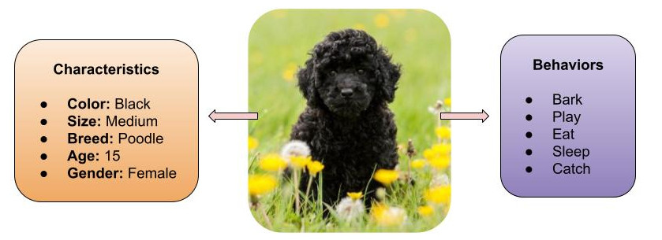
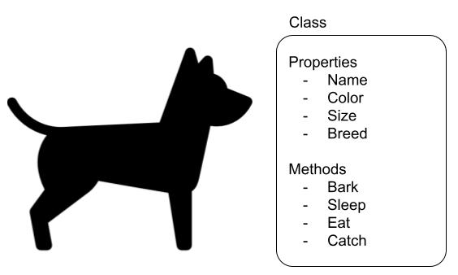
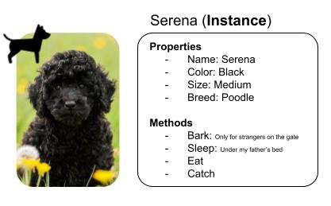

# Object-Oriented Programming

## Basic Concept
There are different ways to build software. One of those ways is the Object-Oriented Programming (OOP).
OOP is a computer programming model that allow us to design and build software based on strutures called **Objects**. One Object is set of characteristics and behaviors that are related to one specific subject or concept. This type of organization helps developers to organize the code, improving reuse and code legibility. 

To better explain the idea, I'll give you an example. Let me present to you my dog, Serena.
Serena was a beautiful poodle dog that I had. She was very playful and very loved by our family during the course of her life. 

### Objects
Serena had her own characteristics. She was black, medium size, poodle breed, but she also had her own behavior. She liked to sleep under my father's bed and barked every time someone was closed to the gate of my home. 

But what Serena has to do with OOP? 

**When we design an software we are designing solution to be used in real world problems**.

So, if we needed to represent Serena in a software, we need to recreate her as an Object.
For this, we look for the Serena's basic nature. That means that for this exercise, we need to know that Serena was a **dog**.

A Dog is a great representation of an object. A dog is the basic and general concept that has characteristics and behaviors related to it. Every single dog in the world has a color, a size and an age. Every dog barks, eats, sleeps, jumps and catchs. Serena is included in this characterists set, because Serena was a dog.

### Classes

A **Class** is the way that we define the Object, is the recipe to build it.
To represent Serena in a software, first we have to create a recipe to build a dog. A class says exactly how a dog should be and how it should behave. The class has a set of **attributes** that storages the dogs characteristics and also has a set of **methods** that represents dogs behaviors. 

With the class we can recreate Serena in the digital world exacly as she was and make many copies as we need. We can do other dogs as well. From now on, we can recreate any dog that we want. 

### Instances

Serena is a specific dog with it's own attributes and methods. That means that when we create Serena, she is a **Instance**. An Instance represents an builded object in the aplication. Once is created, can be used only with the behaviors that were designed to it. Serena will never fly or tip toe, because is a Dog and her recipe does not include those skills.  

   

## Main Principles

There are main principles that we have to follow to be able to build good Object-Oriented Applications.

### Abstraction (Revise)

The dog class is an **Abstration**. It allow us to represent reality inside the software application. Allow us to recreate Serena in the digital world.

### Encapsulation (Revise)

**Encapsulation** is when part of the code is hidden and only selected information is exposed to communication and sharing. This allows the software to better organized, to protect information and behaviors from other parts of the application.

Serena was a black dog. She was born a black dog and for her entire life remained a black dog. 
If we think about it, a dog doesn't need it's color to bark or to sleep. It's color is only defined when was born. 

When we create the Dog object we can apply the same rules to protect the object from unexpected behavior and data integrity. 

A new instance will define the dog's color and that is the only moment that the color of the dog can be set. There is no other method or moment that allow the color to be changed. The color value will be protected inside the object and will be retrieved when necessary. We still be able to know the color if we ask the object but that's it. 

### Inheritance (To do)

### Polymorphism (To do)

## Observations

### Context (Revise)
There is something that you need to consider when designing an object: the **context**. In the context of this example, dogs don't fly because Serena was a real life dog. But perhaps you are building a game and in this game all the dogs fly. You need to consider the context that your solution is envolved, otherwise your objects will not be a good representation of what you trying to build.

# References
- https://www.techtarget.com/searchapparchitecture/definition/object-oriented-programming-OOP
- https://www.freecodecamp.org/portuguese/news/os-quatro-pilares-da-programacao-orientada-a-objetos-com-javascript/

## Blogs
- [POO: o que é programação orientada a objetos? - João Henrique - Alura](https://www.alura.com.br/artigos/poo-programacao-orientada-a-objetos?gclid=Cj0KCQiAnNacBhDvARIsABnDa6_lt2MhsO8eCo85kPOB8GsPFdKsvPKwVxHb9T4DVrclJpCvPGwG7twaAqBIEALw_wcB)
I really liked this one because of the images and examples in different languages. Simple explanation.
- [object-oriented programming (OOP) - Alexander S. Gillis - TechTarget](https://www.techtarget.com/searchapparchitecture/definition/object-oriented-programming-OOP#:~:text=Object%2Doriented%20programming%20(OOP)%20is%20a%20computer%20programming%20model,has%20unique%20attributes%20and%20behavior.)
This one has a more complete definition of the principal.